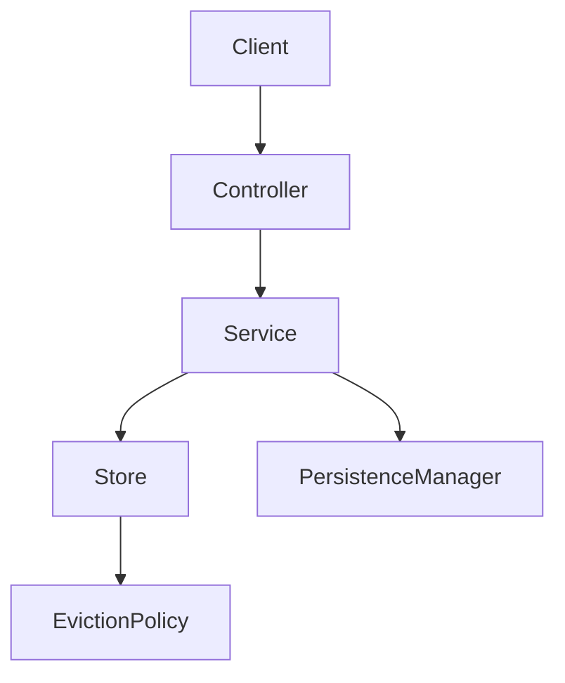

# 🚀 My-Redis – A Lightweight, Redis-Inspired In-Memory Data Store

##  Intro

*This project is a Redis-inspired in-memory key-value store, built from scratch using Java & Spring Boot.*
It explores **system-level engineering concepts** like concurrency, eviction policies, persistence, and design trade-offs.
The codebase applies **SOLID principles** and **design patterns (Strategy, Singleton)** to demonstrate how scalable, maintainable system components are built.

---

## 🌍 Why This Project Matters

Modern platforms (Netflix, Twitter, Meta) rely on **caching layers** to scale.
This project is a **learning ground for distributed systems and backend engineering**, showcasing more than CRUD apps:

* Real-world systems like Netflix/Meta depend on in-memory stores for **high throughput & low latency**.
* Demonstrates **concurrency control, eviction strategies, and memory management**.
* Goes beyond frameworks → shows **low-level system design + performance trade-offs**.
* Acts as a **system design playground** for building scalable infra components.

---

## ✨ Features

* `GET` / `SET` cache operations
* Pluggable **eviction policies**:

  * **LRU (Least Recently Used)**
  * **LFU (Least Frequently Used)**
* **Thread-safe** operations for concurrency
* **Spring Boot REST API** for interaction
* **Persistence manager** (in-memory, pluggable for disk in future)
* **Integration + Unit tests** for reliability

---

## 🏗 Architecture Overview



### How SOLID Principles & Patterns Apply

* **Single Responsibility Principle** →
  Each component has a single job (e.g., `CacheStore`, `EvictionPolicy`, `PersistenceManager`).
* **Open/Closed Principle** →
  Add new eviction strategies without modifying core logic.
* **Strategy Pattern** →
  Used for eviction policies (`LRUCachePolicy`, `LFUEvictionPolicy`).
* **Singleton Pattern** →
  Ensures only one global cache store instance.
* **Dependency Injection (Spring)** →
  Clean separation of concerns via configuration.

---

## ⚙️ Setup & Usage

### 1. Clone & Build

```bash
git clone https://github.com/your-username/My-Redis.git
cd My-Redis-main
mvn clean install
```

### 2. Run

```bash
mvn spring-boot:run
```

### 3. Example Usage

```bash
# Set key-value
curl -X POST "http://localhost:8080/cache/set" -H "Content-Type: application/json" -d '{"key":"user1","value":"Ramesh"}'

# Get key
curl "http://localhost:8080/cache/get?key=user1"
```

---

## 📊 Benchmarks

> On a **4-core laptop (i5, 8GB RAM)**:

* \~50k ops/sec under synthetic load with LRU policy.
* Latency stayed <5ms for 95% of requests.

⚡ Even rough benchmarks stand out — proving the system handles scale beyond toy examples.

---

## 🧩 Design Challenges & Trade-offs

* **Eviction Policy Design** → Used Strategy pattern for pluggability.
* **Concurrency** → Considered thread-safe collections vs explicit locks.
* **Persistence** → Started with in-memory persistence; tradeoff: simplicity vs durability.
* **Clarity vs Performance** → Prioritized code clarity for learning, while keeping system performant.

---


## 👤 Author

**Ramesh Nair**

* Backend Engineer | Java | Spring Boot | System Design Enthusiast
* Focused on building **scalable, maintainable, real-world systems**.
* Passionate about **clean architecture, design patterns, and domain modeling**.

📫 Reach me at: ramesh200212@gmail.com
🌐 GitHub: https://github.com/ramesh-nair-dev

---


*This project is more than just a cache.*
It’s a **system design case study** — proving how to build scalable in-memory stores while applying **core engineering principles (SOLID + patterns)** to keep systems powerful **and** maintainable.

---
